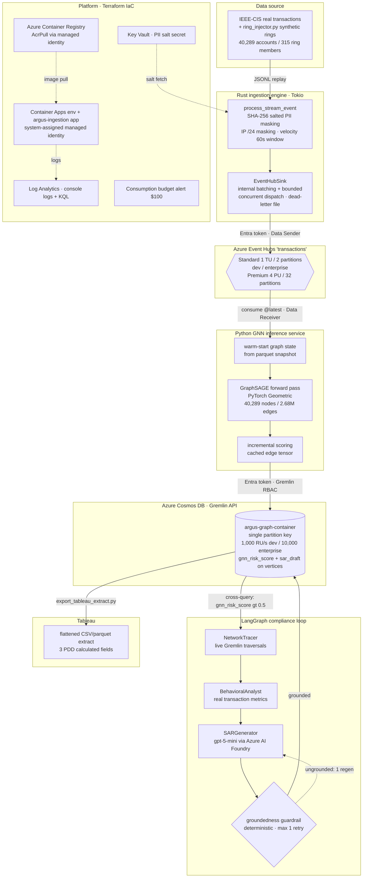

# Argus — Architecture (as actually built)

This reflects the system that was really built and run, not the PDD's
original aspirational diagram. Differences from that diagram are deliberate
and documented in [`../../context.md`](../../context.md) (e.g. SARs are stored
on Cosmos vertices, not a separate Azure SQL Warehouse; the LLM is gpt-5-mini,
not GPT-4o/Claude, due to a subscription quota constraint; Tableau reads a
flattened extract, not a live Synapse connector).

Boxes marked **[dev / enterprise]** are the points where the Chunk 3 `tier`
Terraform variable (and the Chunk-12 benchmark overrides) swap scale — both
sides were actually run and measured (see the SLO scorecard in the README).

## Auth model (no static secrets anywhere)

Every hop authenticates with a Microsoft Entra token, never a key or
connection string:

- **Local dev** → the az-CLI identity (`DeveloperToolsCredential` in Rust,
  `DefaultAzureCredential` in Python) with dev-only RBAC grants.
- **Deployed service** → the Container App's system-assigned managed identity
  (Event Hubs Data Sender/Receiver, Key Vault Secrets User, AcrPull, Storage
  Blob Data Reader, Cosmos Gremlin Data Contributor).

The two paths are deliberately separate and both documented in `context.md`.

## Enterprise-tier swap points (all real, all measured in Chunk 12)

| Component | Dev | Enterprise | Mechanism |
|---|---|---|---|
| Event Hubs | Standard, 1 TU, 2 partitions | Premium, 4 PU, 32 partitions | parallel namespace (Standard→Premium is not in-place) |
| Cosmos throughput | 1,000 RU/s (free tier) | 10,000 RU/s | in-place `benchmark_cosmos_throughput` override |
| Graph loaded | 5.4K-vertex subset | full 142,395 vertices / 1.93M edges | `loader.py --full` (concurrent) |
| Container App replicas | 0–1 | temp 0–5 | `load_test_max_replicas` override |
